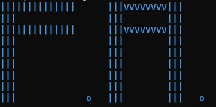

# Fjot Adventures
Text based adventure RPG with a whole bunch of [stuff](./docs). Rendered in beautiful ASCII and written in Python and alternatively C++.

## About
You are a fjot who has woken up and noticed that your entire species has been abducted by the Oxes. You will go on a quest to save the other fjots and defeat the Oxes. Through this journey you, the player unlock special abilities, new knowledge on the world that is.

## Its current state
It is currently in the indev (in development) stage. The goal is to include all of the things in the [docs/](./docs) into the game.

## Contributing
If you're new here feel free to take a look at [CONTRIBUTING.md](./CONTRIBUTING.md)

## Contributors
- owowoowo, developer/creator
- asciifeather, developer/creator
- drift, major brainstormer/artist
